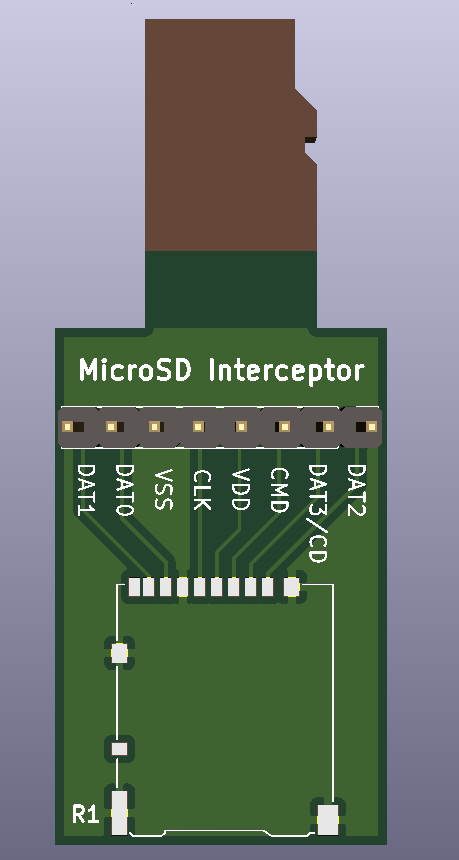

# microsd interceptor

It's a PCB that plugs into MicroSD sockets. It has its own MicroSD socket (DM3AT-SF-PEJM5) that's connected to the other end. All of the signals are also broken out to a 0.1" header. Pretty simple.

MicroSD cards are about 0.7mm thick, so you'll need to find a PCB fab that makes thin boards. OSH park's 2oz PCBs are 0.8mm thick, which is close enough in my experience. There is no copper or soldermask on the top layer in the MicroSD male section, so you can easily file or sand it down a little if you need to.

Oh, and there's a footprint with the MicroSD card outline and pads in the microsd.pretty library. Feel free to use that in your own projects. Nobody should have to experience the tedium of interpreting the physical dimension specs and drawing that in Kicad again.

